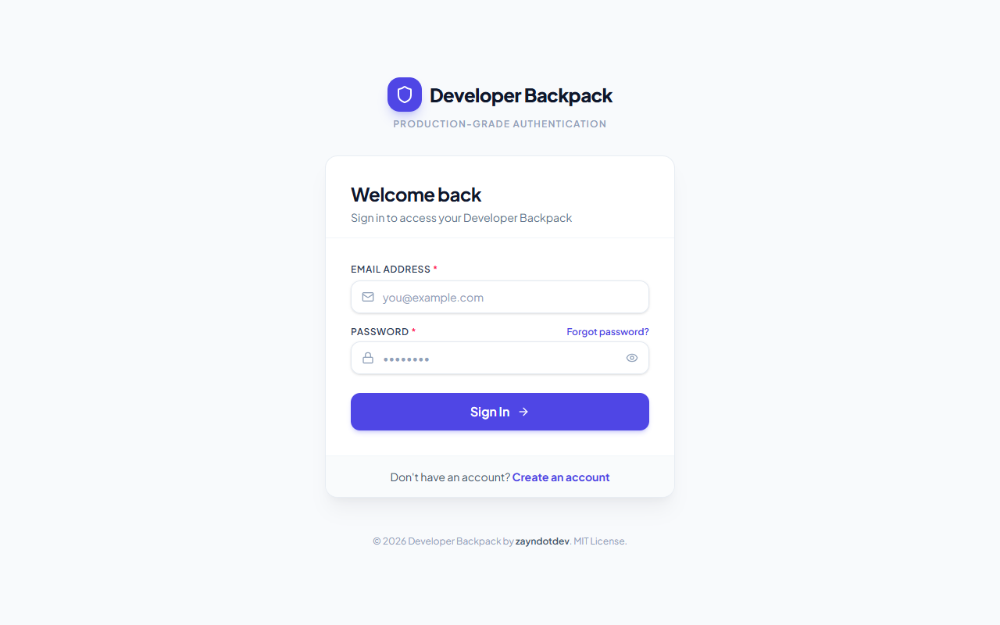
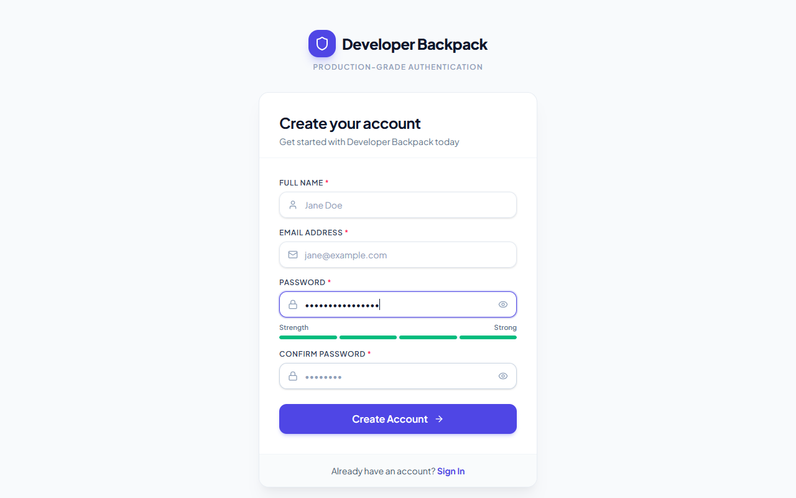
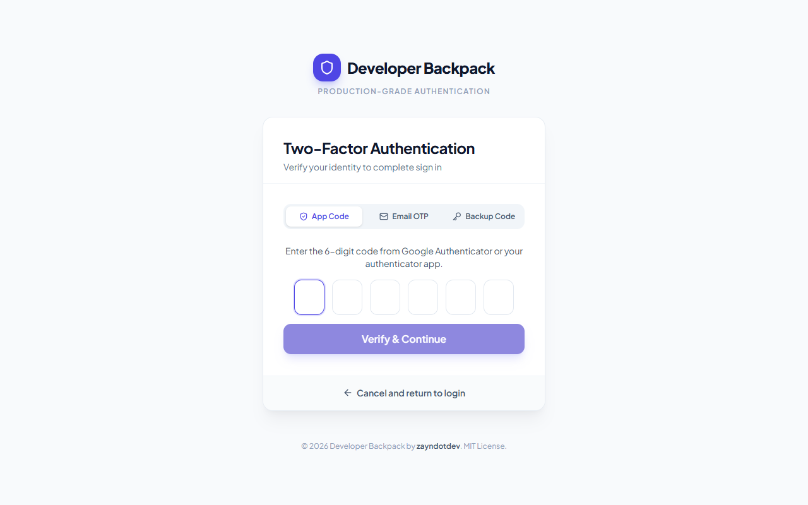
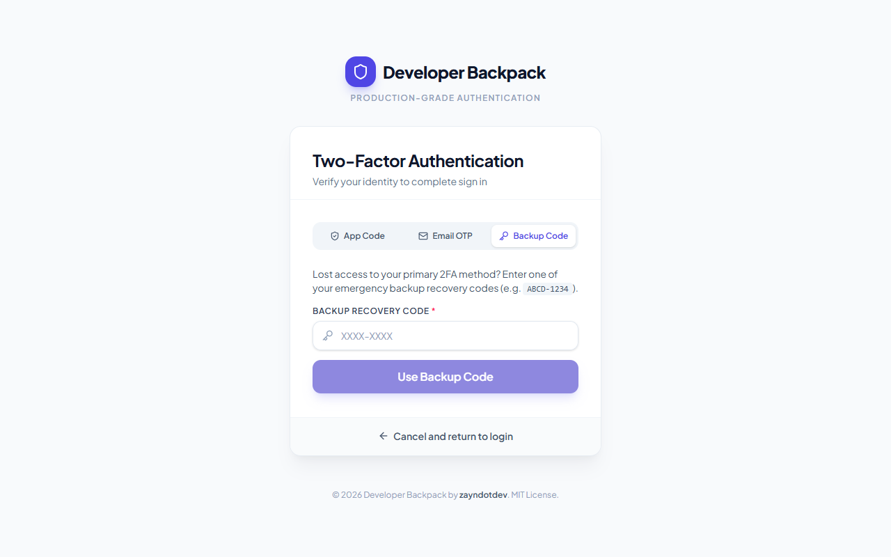
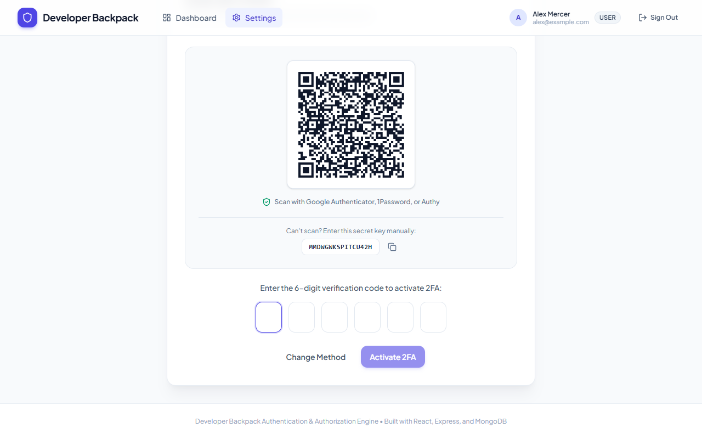
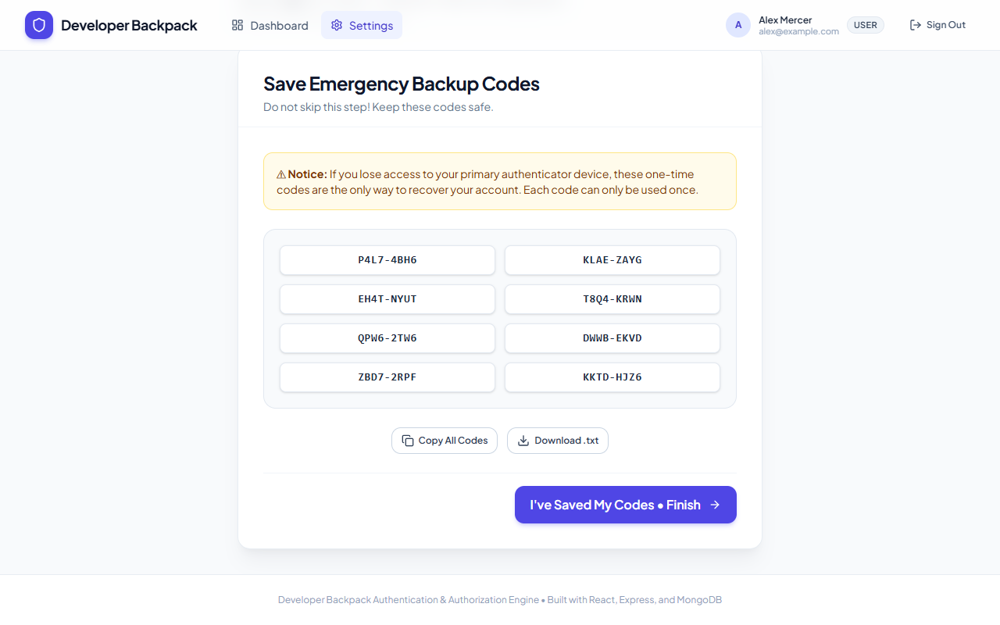
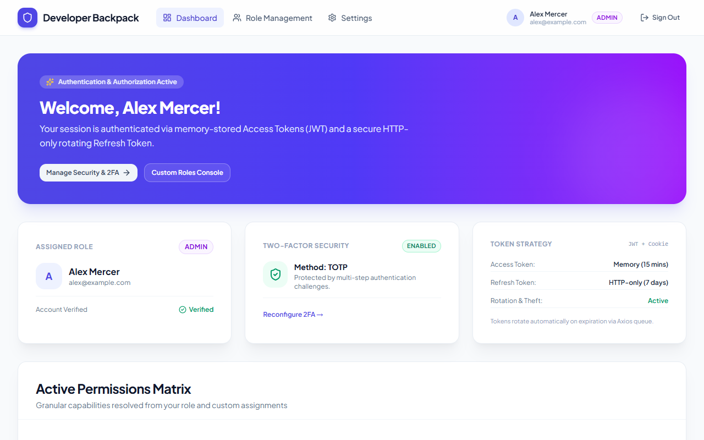
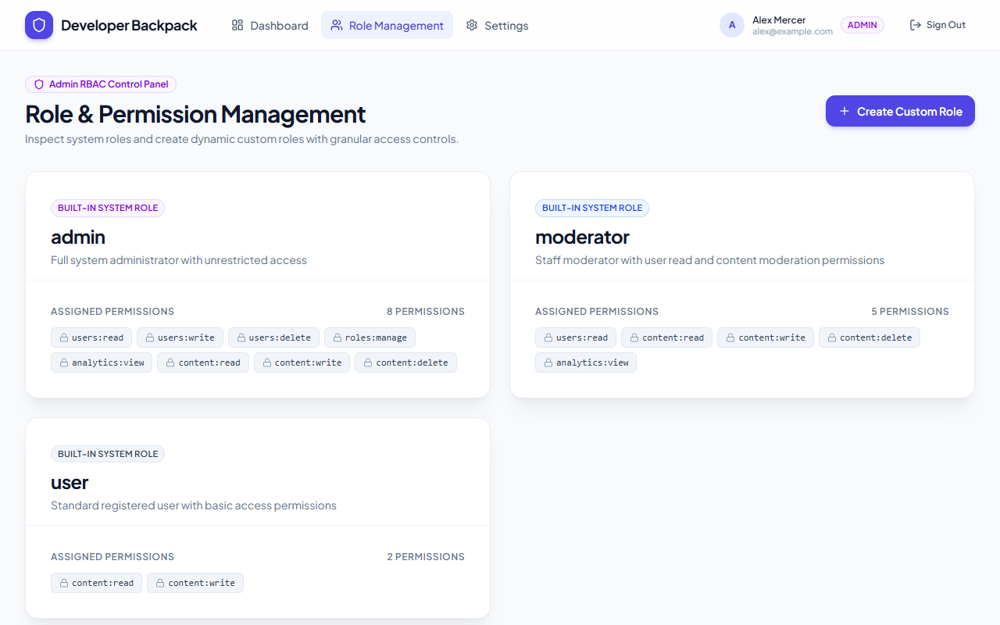
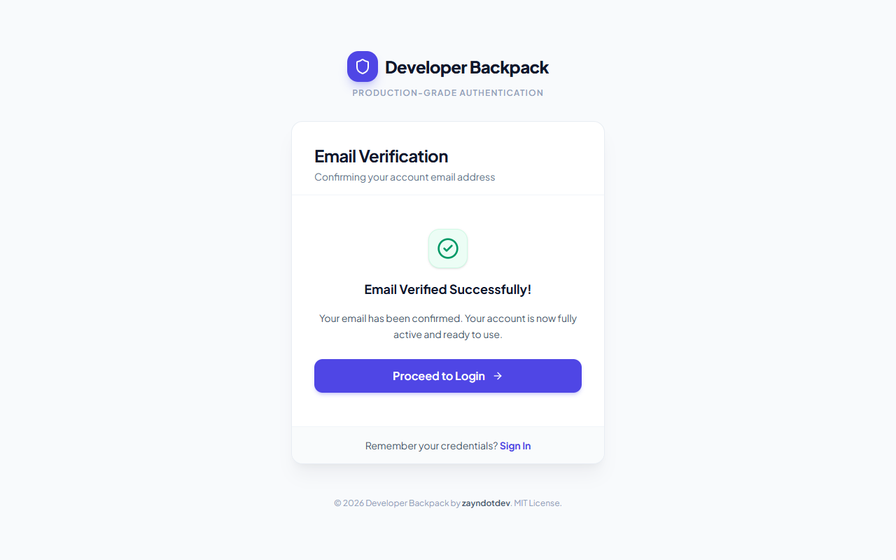
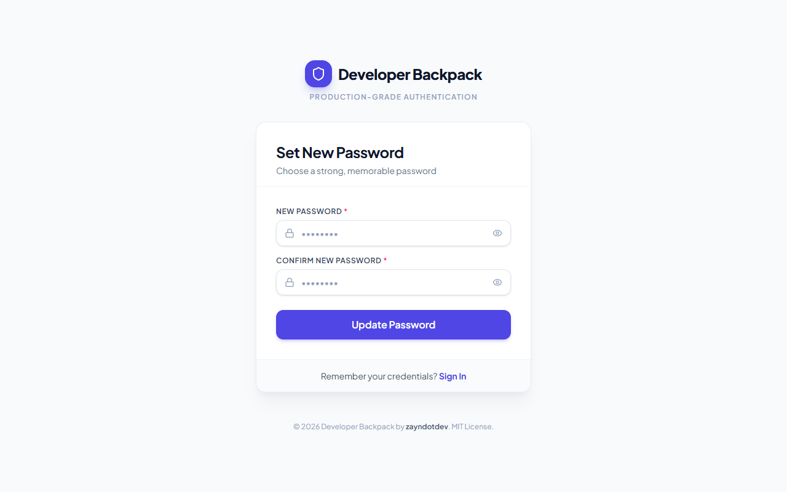

# 🎒 Developer Backpack: Production-Grade Authentication & Authorization System

<div align="center">

[](LICENSE)
[](https://nodejs.org)
[](https://expressjs.com)
[](https://react.dev)
[](https://mongodb.com)
[](https://tailwindcss.com)
[](#-automated-testing-suites-100-pass-rate)

<p align="center">
  <strong>A standalone, reference-quality full-stack authentication and authorization system built with React (Vite + Tailwind CSS) and Node.js (Express + Mongoose).</strong>
</p>

<p align="center">
  <a href="#-visual-showcase--screenshot-walkthrough">Screenshots</a> •
  <a href="#-key-architecture--features">Architecture</a> •
  <a href="#-quick-start-guide">Quick Start</a> •
  <a href="#-api-endpoints-reference">API Reference</a> •
  <a href="#-security-architecture--threat-model">Security Model</a> •
  <a href="#-automated-testing-suites-100-pass-rate">Testing</a> •
  <a href="#-integration-guide-drop-in-to-your-project">Integration Guide</a>
</p>

</div>

---

## 📖 Overview & Purpose

The **Developer Backpack: Authentication System** is engineered to fulfill two key software development needs:

1. **Production-Ready Plug & Play**: A modular, secure auth foundation that you can drop directly into new or existing projects—complete with dual-token JWTs, Google Authenticator TOTP, Email OTP, single-use backup recovery codes, and dynamic role-based access control (RBAC).
2. **Gold-Standard Reference Architecture**: Every file contains detailed architectural headers, explicit cross-file references, line-by-line documentation, and ASCII sequence diagrams on critical security paths (token rotation, refresh reuse breach detection, and MFA challenge issuance).

---

## 📸 Visual Showcase & Screenshot Walkthrough

All screens were designed using research from modern, high-trust SaaS applications (Linear, Stripe, Untitled UI) and verified through automated end-to-end browser testing in real Google Chrome.

### 1. Modern High-Trust Sign In & Sign Up

<table>
  <tr>
    <td width="50%">
      <h4 align="center"><b>Clean Sign In UI</b></h4>
      
      <p align="center"><sub>Subtle elevation, atmospheric background glow, focus rings, and seamless password reveal toggle.</sub></p>
    </td>
    <td width="50%">
      <h4 align="center"><b>Dynamic Password Strength Meter</b></h4>
      
      <p align="center"><sub>Real-time entropy evaluation checking length, lowercase, uppercase, digits, and special symbols.</sub></p>
    </td>
  </tr>
</table>

---

### 2. Multi-Factor Authentication (2FA) & Recovery

<table>
  <tr>
    <td width="50%">
      <h4 align="center"><b>Multi-Step 2FA Challenge</b></h4>
      
      <p align="center"><sub>Paused login issuing temporary MFA ticket. Supports Authenticator App, Email OTP, or Backup Code.</sub></p>
    </td>
    <td width="50%">
      <h4 align="center"><b>Emergency Backup Recovery Code</b></h4>
      
      <p align="center"><sub>One-click tab switch to redeem single-use <code>XXXX-XXXX</code> recovery codes when authenticator is lost.</sub></p>
    </td>
  </tr>
  <tr>
    <td width="50%">
      <h4 align="center"><b>2FA Setup Wizard: QR Code (RFC 6238)</b></h4>
      
      <p align="center"><sub>Live QR code data URL + copyable manual Base32 key with AES-256-GCM encryption at rest.</sub></p>
    </td>
    <td width="50%">
      <h4 align="center"><b>2FA Setup Wizard: 8 Backup Codes</b></h4>
      
      <p align="center"><sub>Formatted 2-column grid with one-click clipboard copy, <code>.txt</code> download, and email dispatch.</sub></p>
    </td>
  </tr>
</table>

---

### 3. Authenticated Dashboard & Dynamic RBAC Console

<table>
  <tr>
    <td width="50%">
      <h4 align="center"><b>Authenticated Admin Dashboard</b></h4>
      
      <p align="center"><sub>Displays user session, active role badge, 2FA health status, token strategy, and live permission tester.</sub></p>
    </td>
    <td width="50%">
      <h4 align="center"><b>Role & Dynamic Permission Management</b></h4>
      
      <p align="center"><sub>Inspect system roles (<code>admin</code>, <code>moderator</code>, <code>user</code>), view granular permissions, and create custom roles.</sub></p>
    </td>
  </tr>
</table>

---

### 4. Account Lifecycle & Self-Service Password Reset

<table>
  <tr>
    <td width="50%">
      <h4 align="center"><b>Email Verification Activation</b></h4>
      
      <p align="center"><sub>Instant one-click activation via cryptographic SHA-256 email tokens.</sub></p>
    </td>
    <td width="50%">
      <h4 align="center"><b>Self-Service Password Reset</b></h4>
      
      <p align="center"><sub>Secure 1-hour expiration reset token flow with live password strength validation.</sub></p>
    </td>
  </tr>
</table>

---

## 🌟 Key Architecture & Features

### 1. Dual-Token JWT Architecture with Token Family Rotation
```
Client (React Memory)               Backend API (Express)                    MongoDB
         |                                    |                                 |
         |----- POST /auth/login ------------>|                                 |
         |                                    |-- Verify Bcrypt Hash ---------->|
         |                                    |-- Create Token Family ID ------>|
         |<---- 200 OK -----------------------|-- Set-Cookie: refreshToken ---->|
         |      { accessToken (15m) }         |   (HttpOnly, SameSite, Secure)  |
         |                                    |                                 |
         |  [15 Minutes Pass: Token Expires]  |                                 |
         |                                    |                                 |
         |----- POST /auth/refresh ---------->|                                 |
         |      Cookie: refreshToken (A)      |-- Verify Family Lineage ------->|
         |                                    |-- Invalidate Token (A) -------->|
         |                                    |-- Issue Token (B) in Family --->|
         |<---- 200 OK -----------------------|-- Set-Cookie: refreshToken (B)->|
         |      { new accessToken }           |                                 |
         |                                    |                                 |
         |  [BREACH ATTEMPT: REPLAY OLD TOKEN]|                                 |
         |                                    |                                 |
         |----- POST /auth/refresh ---------->|                                 |
         |      Cookie: refreshToken (A)      |-- Detects Token (A) Revoked! -->|
         |                                    |-- 🚨 BREACH MITIGATION TRIGGERED|
         |                                    |-- Revoke Entire Family ID ----->|
         |<---- 403 Forbidden ----------------|   (All sessions terminated)     |
```

- **In-Memory Access Tokens**: Short-lived (15 minutes), containing user ID, role, and granular permission array. Stored in JavaScript memory (React Context), preventing cross-site scripting (XSS) extraction from `localStorage`.
- **HTTP-Only Rotating Refresh Tokens**: 64-byte CSPRNG hex strings stored as SHA-256 hashes in MongoDB. Delivered via `HttpOnly`, `SameSite: Strict`, and `Secure` cookies.
- **Silent Refresh Interceptor**: An Axios response interceptor uses a Promise-based mutex queue. When multiple concurrent requests hit 401, only one refresh call is dispatched; the rest wait in queue and retry with the new token.
- **Breach Detection & Family Revocation**: Every refresh rotates tokens within a `familyId`. If an old, already-rotated token is presented (indicating a replay or stolen cookie), the server revokes the entire token family, terminating all attacker and victim sessions immediately.

---

### 2. Multi-Factor Authentication (2FA) Suite

- **TOTP (RFC 6238 - Google Authenticator / Authy)**:
  - Generates Base32 shared secrets and scannable QR Code Data URLs.
  - **AES-256-GCM Encryption**: Secrets are encrypted at rest with a 256-bit key using Authenticated Galois/Counter Mode (with unique 12-byte IVs and 16-byte authentication tags).
  - Time-drift window tolerance supports codes ±30 seconds of system clock skew.
- **Email OTP**:
  - Cryptographically secure 6-digit numeric codes generated with `crypto.randomInt()`.
  - Stored as SHA-256 hashes with a strict 10-minute TTL.
- **Multi-Step Login Challenge**:
  - If 2FA is active, standard password check returns `requires2FA: true` and a temporary, restricted `mfaTicket` (5-minute expiration).
  - Access and refresh tokens are withheld until the challenge code (TOTP, Email OTP, or Backup Code) is verified.
- **Emergency Recovery Backup Codes**:
  - 8 single-use 8-character codes (`XXXX-XXXX`).
  - Stored as SHA-256 hashes in MongoDB; burned immediately upon redemption.
  - Downloadable as `.txt`, copyable to clipboard, and automatically dispatched via email.

---

### 3. Dynamic Role-Based Access Control (RBAC)

- **Predefined System Roles**:
  - `admin`: Full administrative control across users, roles, and settings.
  - `moderator`: Content moderation and user read access.
  - `user`: Standard self-service profile and resource ownership.
- **Custom Dynamic Roles**:
  - Administrators can create runtime custom roles (e.g. `auditor`, `compliance-officer`, `billing-lead`) and assign any subset of granular permissions.
- **11 Granular Permissions**:
  ```
  users:read    • users:write    • users:delete
  roles:create  • roles:assign   • roles:manage
  content:read  • content:write  • content:delete
  analytics:view • settings:manage
  ```
- **Declarative Middleware & UI Gates**:
  - Backend: `requireRole(['admin'])` and `requirePermission(['users:read'])`.
  - Frontend: `<RoleRoute allowedRoles={['admin']}>` and `<ProtectedRoute>`.

---

### 4. Zero-Friction Developer Experience

- **Zero-Config Local Database**: Automatically checks for a running MongoDB daemon (`localhost:27017`). If unavailable, it spins up an embedded in-memory database using `mongodb-memory-server` with zero setup required.
- **Zero-Config Email Testing**: If custom SMTP credentials are not specified, Nodemailer automatically provisions an **Ethereal Mail** test account and logs clickable preview URLs directly to the terminal console.

---

## 📁 Repository Structure

```plaintext
authentication/
├── README.md                      # Complete system documentation (You Are Here)
├── screenshots/                   # 19 High-resolution E2E browser UI test screenshots
│   ├── 01_login_page.png
│   ├── 04_signup_password_strong.png
│   ├── 06_email_verified_success.png
│   ├── 07_dashboard_authenticated.png
│   ├── 09_2fa_setup_step2_qr.png
│   ├── 10_2fa_setup_step3_backup_codes.png
│   ├── 12_login_2fa_challenge.png
│   ├── 14_login_backup_code_input.png
│   ├── 18_dashboard_admin_rbac_success.png
│   └── 19_admin_role_management.png
│
├── backend/                       # Node.js + Express.js + MongoDB API
│   ├── .env.example               # Complete environment variable template (Port 5001)
│   ├── package.json               # Backend dependencies (express, mongoose, otplib, etc.)
│   ├── server.js                  # Entry point, Express pipeline, security headers
│   ├── test-runner.js             # 14-Step automated integration test suite
│   ├── ui-e2e-suite.js            # 10-Phase real Chrome browser automation suite
│   └── src/
│       ├── config/
│       │   ├── constants.js       # System roles, permissions, security constants
│       │   ├── env.js             # Validated environment loader with safe defaults
│       │   ├── db.js              # Resilient MongoDB connector + in-memory fallback
│       │   └── mailer.js          # Nodemailer with auto-Ethereal development fallback
│       ├── controllers/
│       │   ├── authController.js  # Registration, verification, login, refresh, logout
│       │   ├── passwordController.js # Forgot, reset, and change password flows
│       │   ├── twoFactorController.js# TOTP, Email OTP, challenge, backup codes
│       │   ├── userController.js  # User CRUD & profile updates
│       │   └── roleController.js  # Dynamic custom roles & permission matrix
│       ├── middleware/
│       │   ├── authMiddleware.js  # JWT Bearer token authentication
│       │   ├── rbacMiddleware.js  # Role and granular permission enforcement
│       │   ├── rateLimiters.js    # Sensitive endpoint brute-force protection
│       │   ├── validateMiddleware.js # Input validation & sanitization rules
│       │   └── errorMiddleware.js # Global error boundary & 404 handler
│       ├── models/
│       │   ├── User.js            # User profile, bcrypt salt rounds, lockout logic
│       │   ├── RefreshToken.js    # Persistent token families & TTL expiration
│       │   └── Role.js            # Dynamic system and custom RBAC schemas
│       ├── routes/                # authRoutes, twoFactorRoutes, userRoutes, roleRoutes
│       ├── services/
│       │   ├── cryptoService.js   # CSPRNG tokens, SHA-256 hashing, AES-256-GCM
│       │   ├── tokenService.js    # Access/Refresh JWT generation & rotation
│       │   ├── twoFactorService.js# TOTP secret generation, QR codes, backup codes
│       │   └── emailService.js    # HTML email dispatcher & console preview links
│       ├── templates/             # Responsive HTML email templates
│       └── utils/                 # Standardized ApiResponse envelope & logger
│
└── frontend/                      # React JS (Vite + Tailwind CSS) Single Page App
    ├── .env.example               # Frontend environment template (Port 3000)
    ├── package.json               # Frontend dependencies (react 19, tailwindcss, etc.)
    ├── vite.config.js             # Vite configuration with strict port 3000 binding
    ├── tailwind.config.js         # Design tokens, custom brand colors, elevation
    ├── index.html                 # HTML shell with Inter typography
    └── src/
        ├── api/                   # Axios client with mutex token refresh queue
        ├── components/
        │   ├── common/            # ProtectedRoute, RoleRoute, GuestRoute
        │   ├── layout/            # Navbar, AuthLayout, DashboardLayout
        │   └── ui/                # Button, Input, Card, Modal, OTPInput, QRCode, Badge, Alert
        ├── context/               # AuthContext (global state, silent refresh, login/logout)
        ├── hooks/                 # useAuth, useForm, useTwoFactor, useApi
        ├── pages/
        │   ├── auth/              # Login, SignUp, VerifyEmail, Forgot/ResetPassword, 2FA Challenge
        │   ├── dashboard/         # User dashboard & live interactive RBAC permission tester
        │   ├── settings/          # Profile settings, 2FA 3-step wizard, change password
        │   └── admin/             # Role Management & dynamic permission console
        └── utils/                 # Password strength meter, clipboard, file export
```

---

## 🚀 Quick Start Guide

### Prerequisites
- **Node.js**: v18.0.0 or higher
- **npm**: v9.0.0 or higher
- **MongoDB**: (Optional) Local daemon on `localhost:27017` or Atlas URI. *If none is detected, the backend will automatically initialize an in-memory database!*

---

### Step 1: Start the Backend Service (Port 5001)

```bash
cd authentication/backend

# 1. Install dependencies
npm install

# 2. Configure environment (pre-configured with safe defaults)
cp .env.example .env

# 3. Start development server with file watching
npm run dev
```

The backend server starts on **`http://localhost:5001`**.
- Health Check: `http://localhost:5001/api/v1/health`
- Live Email Previews: Clickable Ethereal URLs are logged directly to the terminal when emails are sent.

---

### Step 2: Start the Frontend Application (Port 3000)

```bash
cd authentication/frontend

# 1. Install dependencies
npm install

# 2. Configure environment (pre-configured to target port 5001)
cp .env.example .env

# 3. Start Vite development server
npm run dev
```

Open your browser and navigate to **`http://localhost:3000`**.

---

## 📡 API Endpoints Reference

All API routes follow a standardized JSON envelope structure:
```json
{
  "success": true,
  "message": "Operation completed successfully.",
  "data": { ... }
}
```

### 1. Authentication Endpoints (`/api/v1/auth`)

| Method | Endpoint | Access Level | Description |
|---|---|---|---|
| `POST` | `/signup` | Public | Register new user; dispatches verification email |
| `POST` | `/verify-email` | Public | Activate account using SHA-256 email token |
| `POST` | `/resend-verification`| Public | Request new verification email link |
| `POST` | `/login` | Public | Authenticate; returns tokens or triggers 2FA challenge |
| `POST` | `/refresh` | Public (Cookie) | Rotate refresh token; issues new access/refresh pair |
| `POST` | `/logout` | Public (Cookie) | Invalidate refresh token in DB; clears cookie |
| `POST` | `/forgot-password` | Public | Dispatches 1-hour password reset token link |
| `POST` | `/reset-password/:token` | Public | Sets new password via token; revokes prior sessions |
| `POST` | `/change-password` | Authenticated | Updates password (requires current password check) |
| `GET` | `/me` | Authenticated | Returns profile, active role, and granted permissions |

---

### 2. Two-Factor Authentication (`/api/v1/auth/2fa`)

| Method | Endpoint | Access Level | Description |
|---|---|---|---|
| `POST` | `/setup-totp` | Authenticated | Generates Base32 secret and QR code data URL |
| `POST` | `/enable-totp` | Authenticated | Verifies 6-digit TOTP; activates 2FA; issues 8 backup codes |
| `POST` | `/send-email-otp` | Public / Auth | Dispatches 6-digit numeric OTP to registered email |
| `POST` | `/enable-email` | Authenticated | Verifies email OTP and activates Email 2FA |
| `POST` | `/verify-challenge`| Public (MFA Ticket) | Verifies TOTP, Email OTP, or Backup Code during login |
| `POST` | `/backup-codes` | Authenticated | Regenerates 8 fresh emergency backup recovery codes |
| `POST` | `/disable` | Authenticated | Deactivates 2FA (requires current password verification) |

---

### 3. User Administration (`/api/v1/users`)

| Method | Endpoint | Access Level | Description |
|---|---|---|---|
| `GET` | `/me` | Authenticated | Fetch current user's profile |
| `PUT` | `/me` | Authenticated | Update user display name |
| `GET` | `/` | `users:read` | Paginated list of users (Search & filter) |
| `DELETE` | `/:id` | `users:delete` | Delete user account by ID |

---

### 4. Dynamic Roles & Permissions (`/api/v1/roles`)

| Method | Endpoint | Access Level | Description |
|---|---|---|---|
| `GET` | `/` | Authenticated | List all system/custom roles and permission catalog |
| `POST` | `/` | `roles:manage` | Create a new custom role with selected permissions |
| `PUT` | `/:name/permissions` | `roles:manage` | Update permissions assigned to a custom role |
| `POST` | `/assign` | `roles:manage` | Assign a role to a specific user account |

---

## 🛡️ Security Architecture & Threat Model

| Threat / Attack Vector | Mitigation Strategy Implemented |
|---|---|
| **Cross-Site Scripting (XSS)** | Access tokens are stored strictly in **JavaScript memory** (never in `localStorage` or `sessionStorage`). If an XSS vulnerability occurs elsewhere, tokens cannot be extracted from storage. |
| **Cross-Site Request Forgery (CSRF)**| Refresh tokens are stored in `HttpOnly`, `SameSite: Strict`, and `Secure` cookies. State-changing requests require a Bearer token in the `Authorization` header. |
| **Token Theft & Replay Attacks** | **Refresh Token Rotation & Families**: Every refresh invalidates the previous token. Presenting an already-rotated token triggers **Family Revocation**, immediately terminating all sessions in that family. |
| **Credential Brute-Forcing** | **Account Lockout**: 5 consecutive incorrect passwords automatically lock the account for 15 minutes. |
| **Endpoint Flooding (DoS)** | **Express Rate Limiters**: Strict rate limiting applied to `/login` (5 req / 15m), `/auth/2fa/*` (5 req / 15m), and `/forgot-password` (3 req / 15m). |
| **Secret Compromise at Rest** | **AES-256-GCM Encryption**: TOTP secrets are encrypted with a 32-byte master key and unique 12-byte IVs before hitting MongoDB. |
| **Timing Attacks** | Constant-time comparisons using `crypto.timingSafeEqual()` for hash and token verifications. |

---

## 🧪 Automated Testing Suites (100% Pass Rate)

### 1. Real Chrome Browser UI E2E Test Suite (`ui-e2e-suite.js`)
Controls a real Google Chrome browser via `puppeteer-core` to test user flows from the visual presentation layer:

```bash
cd authentication/backend
node ui-e2e-suite.js
```

**Results**:
- ✅ **Phase 1**: Login Page Visual & Interaction Test
- ✅ **Phase 2**: Sign Up with Dynamic Password Strength Meter (Weak / Fair / Strong)
- ✅ **Phase 3**: Account Verification via Real Link Navigation
- ✅ **Phase 4**: Verified Credential Login & Dashboard Redirection
- ✅ **Phase 5**: Interactive Live RBAC Permission Guard (Live 403 Forbidden verified)
- ✅ **Phase 6**: 3-Step 2FA Setup Wizard (QR Code + TOTP Verification + 8 Backup Codes)
- ✅ **Phase 7**: Multi-Step 2FA Login Challenge with Google Authenticator
- ✅ **Phase 8**: Emergency Backup Code Login & Single-Use Burning
- ✅ **Phase 9**: Forgot Password Request & Password Reset with Entropy Meter
- ✅ **Phase 10**: Admin Role Management Console & Admin RBAC Verification

---

### 2. Full-Stack Backend Integration Test Suite (`test-runner.js`)
Validates all 14 backend lifecycle flows programmatically:

```bash
cd authentication/backend
node test-runner.js
```

**Results**:
- ✅ **Test 1**: System Health Probe (`/api/v1/health`)
- ✅ **Test 2**: User Registration with SHA-256 Token Dispatch
- ✅ **Test 3**: Unverified Account Gate (403 Forbidden)
- ✅ **Test 4**: Cryptographic Email Verification
- ✅ **Test 5**: Verified Login (Access Token + HttpOnly Refresh Cookie)
- ✅ **Test 6**: Protected Route Access (`/auth/me`) via Bearer Token
- ✅ **Test 7**: Silent Refresh Token Rotation
- ✅ **Test 8**: Token Reuse Detection & Emergency Family Revocation
- ✅ **Test 9**: 2FA TOTP Activation & AES-256-GCM Encryption
- ✅ **Test 10**: Multi-Step MFA Challenge Issuance (`mfaTicket`)
- ✅ **Test 11**: TOTP Challenge Code Verification & Session Grant
- ✅ **Test 12**: Backup Recovery Code Authentication & Single-Use Burning
- ✅ **Test 13**: RBAC Permission Guard (`users:read` blocked for standard user)
- ✅ **Test 14**: Admin RBAC Authorization (`users:read` granted to admin)

---

## 🔌 Integration Guide: Drop In to Your Project

### Option A: Use the Pre-Built UI in Your React Project

1. Copy the design system components:
   ```
   src/components/ui/     -> (Button, Input, Card, Modal, OTPInput, Badge, Alert)
   src/components/common/ -> (ProtectedRoute, RoleRoute, GuestRoute)
   src/context/           -> (AuthContext.jsx)
   src/hooks/             -> (useAuth.js, useForm.js, useTwoFactor.js)
   src/api/               -> (client.js, authService.js)
   ```
2. Wrap your application tree with `<AuthProvider>`:
   ```jsx
   import { AuthProvider } from './context/AuthContext';

   export default function App() {
     return (
       <AuthProvider>
         <YourRoutes />
       </AuthProvider>
     );
   }
   ```
3. Protect private routes with `<ProtectedRoute>` or `<RoleRoute>`:
   ```jsx
   <Route
     path="/admin"
     element={
       <RoleRoute allowedRoles={['admin']}>
         <AdminPage />
       </RoleRoute>
     }
   />
   ```
4. Access auth state anywhere in your components:
   ```jsx
   import { useAuth } from './hooks/useAuth';

   const MyComponent = () => {
     const { user, isAuthenticated, hasPermission, logout } = useAuth();

     return (
       <div>
         <h1>Hello, {user?.name}!</h1>
         {hasPermission('users:delete') && <button>Delete User</button>}
         <button onClick={logout}>Sign Out</button>
       </div>
     );
   };
   ```

---

### Option B: Use the Express Backend Service

1. Copy `authentication/backend/src/` into your Express project.
2. Mount the routes into your Express application:
   ```javascript
   import express from 'express';
   import cookieParser from 'cookie-parser';
   import authRoutes from './routes/authRoutes.js';
   import twoFactorRoutes from './routes/twoFactorRoutes.js';
   import userRoutes from './routes/userRoutes.js';
   import roleRoutes from './routes/roleRoutes.js';

   const app = express();
   app.use(express.json());
   app.use(cookieParser());

   app.use('/api/v1/auth', authRoutes);
   app.use('/api/v1/auth/2fa', twoFactorRoutes);
   app.use('/api/v1/users', userRoutes);
   app.use('/api/v1/roles', roleRoutes);
   ```
3. Protect individual endpoints using the middleware:
   ```javascript
   import { verifyAuth } from './middleware/authMiddleware.js';
   import { requireRole, requirePermission } from './middleware/rbacMiddleware.js';

   // Protected by authenticated session
   app.get('/api/v1/profile', verifyAuth, getProfile);

   // Protected by role
   app.get('/api/v1/admin/audit', verifyAuth, requireRole(['admin']), getAuditLogs);

   // Protected by granular permission
   app.delete('/api/v1/posts/:id', verifyAuth, requirePermission(['content:delete']), deletePost);
   ```

---

## 📄 License

This project is part of the **Developer Backpack** and is released under the [MIT License](LICENSE). You are free to use, modify, distribute, and embed this code in personal, educational, and commercial projects.
